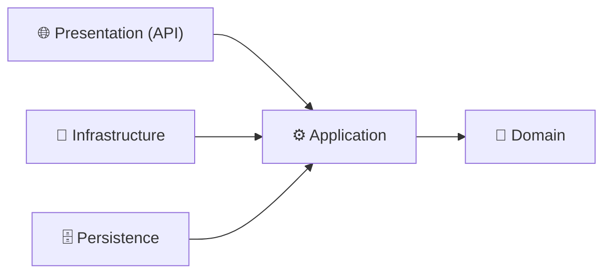

<div align="center">


</div>

## 🧭 Why OnionSetUp?

Every new backend project starts with the same ritual — solution structure, authentication, exception handling, response wrappers, migrations. **OnionSetUp removes that ritual.** Clone it, rename it, and start writing business logic on day one, on top of a clean Onion Architecture foundation.

## ✨ Features

- 🧅 **Full Onion Architecture** — Domain, Application, Persistence, Infrastructure, Presentation layers with a strict inward dependency rule
- 🔐 **JWT Authentication** — token generation and validation built on ASP.NET Core Identity via a dedicated `IdentityService`
- 🛡️ **Global Exception Middleware** — centralized error handling; no try/catch noise in controllers
- 📦 **`Response<T>` wrapper** — every endpoint returns a consistent response shape with status code, data, and errors
- 🕵️ **Automatic auditing** — entities implementing `IAuditable` get their audit fields set by a `SaveChangesInterceptor`, no manual tracking
- 🗑️ **Soft delete** — entities implementing `ISoftDeletable` are flagged as deleted instead of being removed from the database
- 🌱 **`DataInitializer`** — applies pending migrations and seeds initial data automatically on startup
- 📖 **Modern API docs** — interactive documentation powered by Scalar

## 🏛️ Architecture



| Layer | Responsibility |
|:---|:---|
| **Domain** | Entities and core business rules — zero external dependencies |
| **Application** | Abstractions, DTOs, and business logic — depends only on Domain |
| **Persistence** | EF Core `DbContext`, entity configurations, interceptors, migrations |
| **Infrastructure** | External concerns — Identity, JWT token generation |
| **Presentation** | Controllers, middleware pipeline, DI composition root |

> The dependency rule: **all dependencies point inward.** Outer layers know about inner layers — never the reverse.

## 🚀 Getting Started

**Prerequisites:** .NET 9 SDK · SQL Server

```bash
git clone https://github.com/vusal016/OnionSetUp.git
cd OnionSetUp
```

1. Update the connection string in `appsettings.json`
2. Run the API:

```bash
dotnet run
```

3. That's it — `DataInitializer` applies migrations and seeds data automatically. No manual `dotnet ef database update` needed.
4. Open the Scalar docs at `https://localhost:<port>/scalar/v1`

## 🔐 Authentication

The boilerplate ships with ready-to-use auth endpoints backed by ASP.NET Core Identity:

| Method | Endpoint | Description |
|:---|:---|:---|
| `POST` | `/api/auth/register` | Create a new user account |
| `POST` | `/api/auth/login` | Authenticate and receive a JWT |
| `POST` | `/api/auth/logout` | Stateless logout — the client discards the token |

All responses follow the `Response<T>` pattern — success returns the payload with its status code, failure returns structured errors.

## 🗺️ Roadmap

- [ ] Refresh token flow
- [ ] Token blacklist for server-side logout
- [ ] Sample CRUD module demonstrating the full request pipeline

## 📄 Using This as a Template

1. Clone the repository
2. Rename the solution and project namespaces to match your product
3. Update the connection string — and start building

## 👤 Author

**Vusal Mammadov** — .NET Backend Developer

<a href="https://www.linkedin.com/in/vusalmemmedov">
  
</a>
<a href="mailto:mvusal316@gmail.com">
  
</a>


